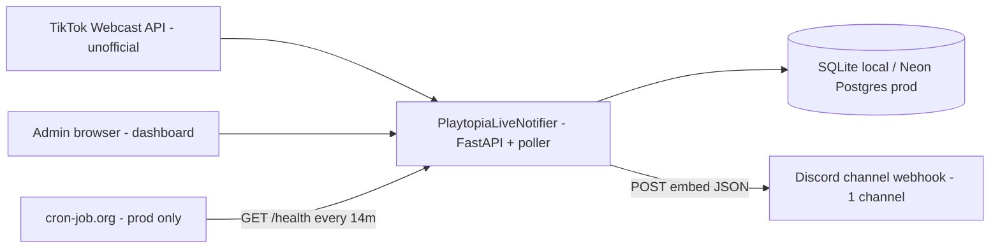
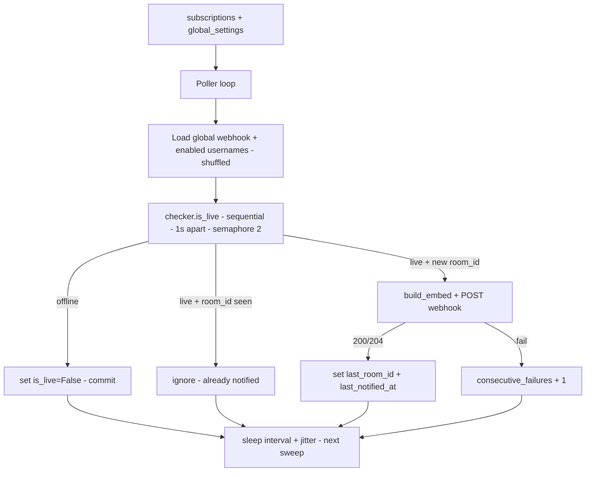
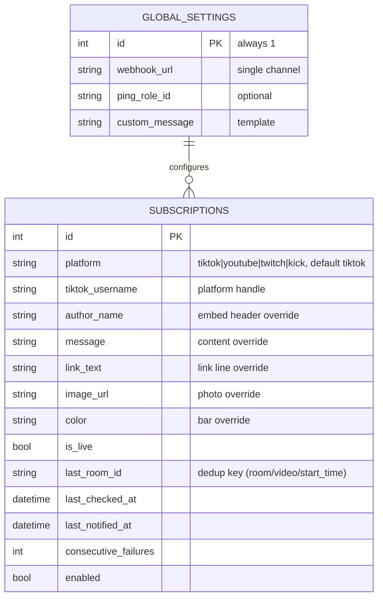
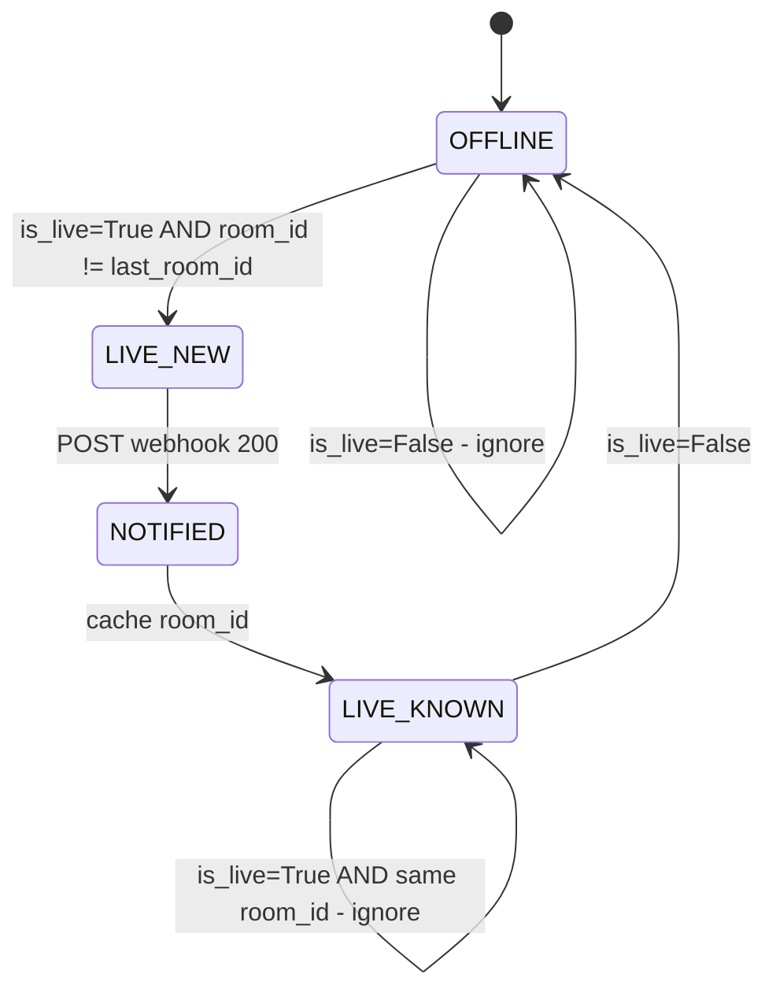
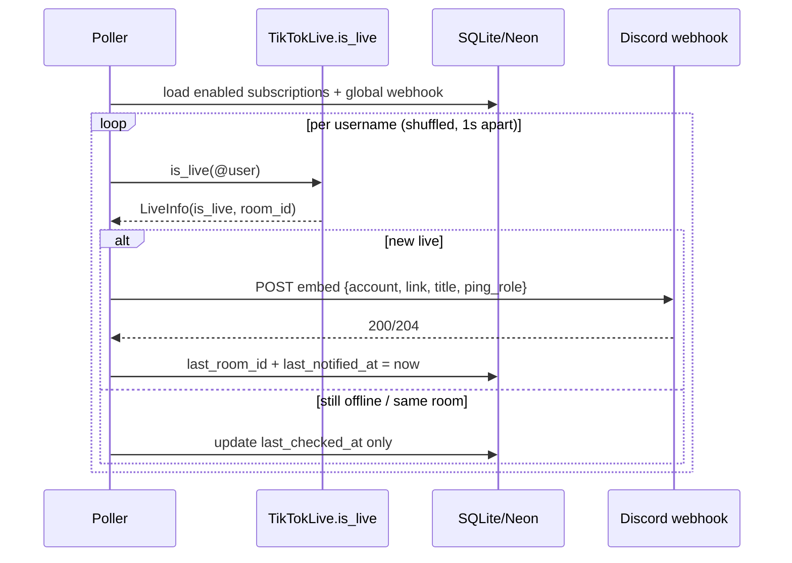
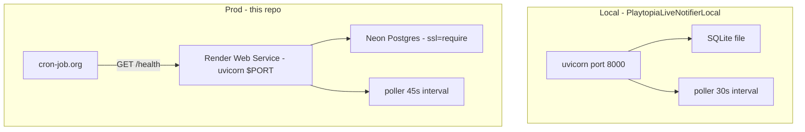

# PlaytopiaLiveNotifier — System Plan

> Multi-platform LIVE → Discord notifier (TikTok, YouTube, Kick live-checked; Twitch stored, poller pending).
> Local: `PlaytopiaLiveNotifierLocal` (SQLite). Prod: this repo (Render + Neon).
> Comfort cap: 60 creators across all platforms (~2.5–3 min cycle).

## 0. Scope

In:
- Track creators per platform (TikTok @username, YouTube @handle/channel, Twitch login, Kick slug — link or handle accepted, normalized per platform), detect LIVE start, POST embed to 1 Discord channel webhook
- Dashboard: platform filter card, creator cards grid, EDIT (modal) / PREVIEW (Discord render + raw JSON) / REMOVE / TEST / FORCE per card, global defaults, admins + audit log
- Deduplicate: one ping per live session (session id + 15 min cooldown); inconclusive checks preserve state
- External cron trigger: `/api/cron/poll` with admin session OR `CRON_SECRET`

Out:
- Video uploads, chat/gifts/viewer tracking, multi-server, Discord bot/slash commands, paid APIs

Success criteria:
- Detection latency < 2.5 min at 60 creators, < 1.5 min at 15 creators
- Zero duplicate pings per live session
- Survives Render sleep/restart without resending old lives

## 1. Data to gather

### 1.1 Creators (fill in — 15 slots)

| # | TikTok input (link or @user) | Normalized `@username` | Live freq | Avg duration | Notes |
|---|------------------------------|------------------------|-----------|--------------|-------|
| 1 | | | | | |
| 2 | | | | | |
| 3 | | | | | |
| 4 | | | | | |
| 5 | | | | | |
| 6–15 | | | | | |

Rule: if most lives are shorter than your poll cycle (Section 5), they can be missed. Typical TikTok lives are 30 min+, so a 1–2.5 min cycle is safe.

### 1.2 Discord (single channel)

| Item | Value |
|------|-------|
| Webhook URL | `https://discord.com/api/webhooks/...` (Channel → Integrations → Webhooks → Copy) |
| Ping role ID | (Developer Mode → Copy ID, optional) |
| Message template | `{ping_role} {account} is LIVE! {link}` |
| Test result | `POST /api/subscriptions/{id}/test` delivers embed |

Tags supported: `{account}` `{link}` `{title}` `{viewers}` `{ping_role}`.

### 1.3 TikTok validation (do before building further)

Run `checker.is_live()` for 3 real usernames in a loop for 1 hour. Record:
- Avg latency per check (expect 0.8–2s)
- Failure shapes: user-not-found, offline, timeout, 429 rate-limit
- Library version pinned (`TikTokLive==6.2.1` in `requirements.txt`)

TikTok has no official live-status API. `TikTokLive` reads the same internal webcast endpoint the browser uses. HTML scraping is not used (fragile, blocked fast).

## 2. Tools

| Purpose | Tool |
|---------|------|
| Diagrams | Mermaid in markdown (this file) + draw.io for ERD edits |
| API test | `curl` / Postman: `GET /health`, `GET /api/settings`, `POST /api/subscriptions` |
| DB inspect | DBeaver (local `playtopia_local.db`), Neon console (prod) |
| Logs | Local console, Render Dashboard → Logs (webhook URLs and secrets are redacted) |
| Keep-alive (prod) | cron-job.org → `GET /health` every 14 min |

## 3. Architecture diagrams

### 3.1 Context



### 3.2 Data flow (one sweep)



### 3.3 ERD



Uniqueness is composite `(platform, handle)`: one row per platform account. Migrations in `app/db.py:init_db` are dialect-aware (SQLite PRAGMA path + Postgres `IF NOT EXISTS` path) and idempotent — redeploys are safe.

File mapping: `app/models.py` → tables, `app/db.py` → engine/session/`init_db`, `app/config.py` → tuning + caps.

### 3.4 Live state machine (dedup logic)



Cooldown: same `room_id` re-notified only after 15 min (`NOTIFICATION_COOLDOWN_SECONDS=900`).

### 3.5 Sequence (notify path)



### 3.6 Deployment (local vs prod)



Render settings: build `pip install -r requirements.txt`, start `uvicorn app.main:app --host 0.0.0.0 --port $PORT`, health check `/health`. No Dockerfile. Code mapping: `app/main.py` (lifespan starts `poll_loop`), `app/poller.py` (sweep), `app/tiktok.py` (checker), `app/webhook.py` (embed + POST), `app/api/routes.py` (dashboard API), `app/templates/dashboard.html` (UI).

## 4. Tech stack (locked)

Python 3.12/3.13, FastAPI + uvicorn, SQLAlchemy 2 async, `TikTokLive==6.2.1`, httpx (webhook POST), Jinja2 + Tailwind CDN (dashboard), pydantic-settings (`.env`), aiosqlite (local) / asyncpg + Neon (prod).

Why webhook not bot: no `DISCORD_TOKEN`, no persistent Discord gateway, fits 512 MB Render Free, less RAM and fewer disconnects. Trade-off: admin pastes webhook URL manually; no slash commands or auto channel picker.

## 5. Capacity model

Formula: `cycle = creators x (check_latency + PER_CHECK_SLEEP) + CHECK_INTERVAL`

| Creators | Sleep | Interval | Est. cycle | Detection | Verdict |
|----------|-------|----------|------------|-----------|---------|
| 15 | 1.0s | 45s | ~1 min | < 1.5 min | Current — comfortable |
| 50 | 1.0s | 45s | ~2 min | < 2.5 min | Comfortable |
| 60 | 1.0s | 45s | ~2.3 min | < 3 min | Comfort cap (`MAX_CREATORS=60`) |
| 100 | 1.2s | 75s | ~5 min | 4–5 min | Over cap — short lives can be missed |

"Missed" means: a live shorter than the cycle can start and end between two checks of the same user, so no ping is ever sent. Enforced in `app/config.py: MAX_CREATORS` + `POST /api/subscriptions` (409 duplicate, 400 over cap).

## 6. Build slices (in order)

1. Poller + webhook with 1 hardcoded user → confirm Discord embed arrives
2. SQLite/Neon + dedup (`last_room_id`, cooldown, `_last_room_cache`)
3. Dashboard: settings card once + add-by-link/username + Test/Remove
4. Hardening: input validators (`app/schemas.py`), session login + roles (`app/security.py`), cron secret for external triggers, redacted logs (`app/logging_config.py`), `/health`
5. Deploy prod: GitHub → Render → env (`DATABASE_URL`, `SUPERADMIN_*`, `CRON_SECRET`, platform keys) → cron-job.org (`/health` + `/api/cron/poll?secret=`)

## 7. Test plan

- [ ] Offline → Live → Discord ping arrives once with role mention
- [ ] Still live on next sweep → no second ping
- [ ] Live ends → `is_live=False`, no message
- [ ] New live later (new `room_id`) → pings again
- [ ] `Test` button works while user offline (preview embed)
- [ ] Bad username rejected, duplicate returns 409, 61st creator returns 400
- [ ] Bad webhook → 502 with actionable message, `consecutive_failures` increments
 - [ ] Restart app → no resend of old live (DB `last_room_id` persists)
 - [ ] `/health` returns `poller_running: true`
 - [ ] `/api/cron/poll?secret=wrong` → 403; `?secret=right` → sweep counts
 - [ ] YouTube premiere/upcoming never notifies; consent-blocked fetch preserves card state
 - [ ] Kick without keys: sweep skipped, cards show `polling: soon`
 - [ ] PREVIEW modal matches the Discord message (buttons need `?with_components=true`, applied at send time)

## 8. Runbook

Local:
```powershell
cd PlaytopiaLiveNotifierLocal
.\venv\Scripts\activate
python -m uvicorn app.main:app --reload --port 8000
# http://localhost:8000
```

Prod deploy: push → Render builds → set env → open `/` → save webhook → add usernames → cron-job.org `GET /health` every 14 min.

Logs to watch: `poller started`, `poll sweep checked=N notified=M`, `notified @user`, `webhook failed status=`. Never log full webhook URLs or secrets.
